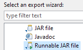

# SAP PO Java Mapping OnlineChequeXMLToJSON 

Example of jaxb unmarshalling and json serialisation using google gson library

## Important

resulting mapping jar should be exported via wizard using option "Runnable Jar"

Using fat jar is 10x-50x faster in runtime message mapping pipeline than adding dependencies as standalone "Imported Archive". 